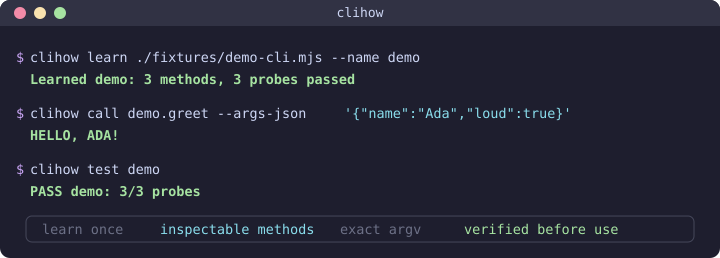

<div align="center">

# clihow 🧭

**Learn a CLI once. Let every agent use it.**

Turn installed commands into tested methods that you, Codex, Claude, Pi, and other agents can discover and call.

[](package.json)
[](LICENSE)
[](#current-status)

</div>

<p align="center">
  
</p>

`clihow` reads a command's own help, turns it into a small local method manifest, and tests each method before saving it. You and your agents can inspect that manifest, choose a method from plain language, preview the exact arguments, or call the method directly. Before a call, `clihow` checks the binary and the arguments. It then runs the original command without a shell.

```text
installed CLI -> captured help -> tested manifest -> validated argv -> installed CLI
```

## Why

- **Stop teaching syntax every session.** Learn a CLI once and reuse the same methods from Codex, Claude, Pi, another agent, or your own terminal.
- **Inspect before you act.** Every method has typed arguments, a risk level, source evidence, and a harmless verification probe.
- **Keep execution predictable.** `clihow` checks the binary fingerprint, validates every argument, and invokes the binary without a shell.
- **See what the model sees.** Print the next prompt without sending it, or save the prompts and responses from a run.
- **Continue questions from another terminal.** Successful asks become private threads with explicit IDs and searchable history.

## Install

`clihow` is currently installed from source. You need:

- Node.js 22 or newer
- pnpm
- [Pi](https://github.com/earendil-works/pi) available as `pi`
- Pi access to `openai-codex/gpt-5.6-luna`

```bash
git clone https://github.com/testy-cool/clihow.git
cd clihow
pnpm install
pnpm build
pnpm link --global
clihow doctor
```

`clihow doctor` checks Pi, the locked model configuration, and the local registry before you learn anything.

## Quick start

The repository includes a harmless demo CLI, so you can run the complete loop without giving `clihow` access to another tool.

```bash
# Read its help, compile three methods, and run all three help probes.
clihow learn ./fixtures/demo-cli.mjs --name demo

# Read the compact guide that agents discover.
clihow help demo

# Let Luna bind plain language, but stop before execution.
clihow use demo "greet Ada loudly" --dry-run --json

# Call the validated method directly.
clihow call demo.greet --args-json '{"name":"Ada","loud":true}'

# Recheck the binary and every stored probe.
clihow test demo
```

The learn, call, and test steps produce:

```text
Learned demo: 3 methods, 3 probes passed
HELLO, ADA!
PASS demo: 3/3 probes
```

Learn a tool you already use in the same way:

```bash
clihow learn gh
clihow help gh
clihow use gh "list the ten newest repositories" --dry-run --json
```

## What you get

| Command | What it does | Does it run the learned CLI? |
|---|---|---|
| `clihow learn <binary>` | Captures help, compiles a manifest, validates it, and runs help probes | Yes, for bounded version and help probes |
| `clihow help <name>` | Shows a compact guide for one learned CLI | No |
| `clihow list --json` | Lists every learned primitive | No |
| `clihow describe <name>[.<method>] --json` | Returns the exact stored contract | No |
| `clihow use <name> <intent>` | Selects a method from plain language and binds its arguments | Yes, unless you add `--dry-run` |
| `clihow call <name>.<method>` | Calls one known method with validated JSON arguments | Yes, unless you add `--dry-run` |
| `clihow ask [<name>] <question>` | Answers from stored evidence or uses a declared read-only question method | Only when that validated question method exists |
| `clihow test <name>` | Rechecks the fingerprint and stored help probes | Yes, for the stored help probes |
| `clihow threads` | Browses completed asks through agentconvos | It runs agentconvos, not a learned method |
| `clihow doctor` | Checks Pi, Luna, and registry access | No |

Use `help` when a person or agent needs a readable guide. Use `describe` and `call` when the caller already knows the exact contract. Use `use` when choosing and binding the method is the hard part.

## How learning works

1. `clihow` resolves the executable and records its path, version, size, modification time, and SHA-256 fingerprint.
2. It runs bounded version and help probes inside temporary HOME and XDG directories.
3. Pi runs Luna with High thinking to turn the captured help into a small method manifest. Tools, sessions, skills, extensions, and ambient agent context are disabled.
4. A deterministic validator rejects commands, options, parameters, evidence references, or probes that the captured help does not support.
5. `clihow` runs each non-mutating help probe and saves the primitive only when all probes pass.
6. Before a later call, `clihow` checks the fingerprint again and builds the exact argument array from the stored contract.

If the first manifest fails validation, Luna gets the exact validator error and one chance to repair it. `clihow` never relaxes the validator or executes the rejected manifest.

## Ask what a CLI knows

`ask` is the agentic RAG layer over the active registry and captured help. Luna receives that packet as its only task context, and every sufficient answer must cite source IDs from the packet.

```bash
# Search every learned CLI and clihow's own runtime metadata.
clihow ask "Which learned CLI can manage agent sessions?"

# Ask only about clihow.
clihow ask clihow "Where do you keep your data?" --json

# Ask one learned CLI.
clihow ask herdr "Which operations change state?" --json
```

Each sufficient answer includes source IDs that `clihow` checks against the exact evidence packet sent to Luna. The response contract has an explicit `insufficientEvidence` result for questions the packet cannot support.

A learned primitive can declare one validated read-only question method. In that case, a scoped ask calls that method instead of sending another model prompt. The `agentconvos` primitive uses this path to search conversation history while its Rich progress display stays visible.

## Continue a question later

Every successful ask becomes a durable thread. The transcript provides continuity, so follow-ups do not depend on a hidden provider session.

```bash
# Start a research thread.
clihow ask agentconvos \
  "find the conversation where I created the MCP selector launcher"

# Continue the same research from another terminal.
clihow ask --thread THREAD_ID \
  "Which repository did that work create?"

# Browse with the agentconvos Textual interface or fzf.
clihow threads
clihow threads --find "MCP selector"

# Read the newest-first inventory without opening a TUI.
clihow threads --json
```

Plain output keeps the answer on stdout and writes the thread ID and continuation hint to stderr. JSON output includes `threadId`. UUID prefixes work when they identify one thread. There is no global `last` thread, so two terminals cannot silently continue each other's work.

Threads live under `~/.local/share/clihow/threads`. Files use mode `0600`, and the thread and lock directories use mode `0700`. Earlier answers are navigation context. A follow-up rechecks the learned evidence or the native conversation turns cited by the previous answer.

The interactive `threads` and `threads --find` commands require [agentconvos](https://github.com/testy-cool/agentconvos). Core learning, inspection, calling, and JSON thread inventory do not.

## Inspect every model prompt

Print the exact next prompt without contacting Pi:

```bash
clihow learn gh --show-prompt
clihow use gh "list the ten newest repositories" --show-prompt
clihow ask gh "How do I list repositories?" --show-prompt
```

Record the prompts and captured Pi responses from a normal run:

```bash
clihow ask gh "How do I list repositories?" \
  --trace-prompts ./clihow-prompt-traces \
  --json
```

Each exchange is saved as JSON that only your user account can read. The record includes the engine, exact prompt, captured stdout and stderr, exit status, duration, and truncation state. A trace can contain your intent and the complete captured help, so keep the directory private. `--show-prompt` and `--trace-prompts` cannot be combined.

## Use clihow from an agent

The repository includes an agent skill at [`skills/clihow/SKILL.md`](skills/clihow/SKILL.md). Link it into Codex from a source checkout:

```bash
mkdir -p ~/.codex/skills
ln -s "$PWD/skills/clihow" ~/.codex/skills/clihow
```

Other agents can use the same skill text or call the JSON commands directly. The skill teaches the public `clihow` contract. Agents do not need to know that Pi and Luna implement learning and method selection.

## Safety and scope

`clihow` reduces command guessing. It cannot make an untrusted executable safe.

- Learning executes the target with version and help arguments. Do not learn a binary you would not run yourself.
- Help text and model output are untrusted input. Luna receives no tools, and deterministic validation rejects unsupported output.
- Calls use the resolved executable path and check its SHA-256 fingerprint before execution.
- Arguments go directly to the child process. Shell syntax remains plain argument data.
- Methods marked `write` or `destructive` require `--yes`. `clihow` also raises the risk for obvious mutation verbs such as `create`, `update`, and `delete`.
- Grounded answers are still model-generated. Inspect consequential guidance before turning it into a call.
- Risk classification can be imperfect. Review a new manifest before approving a consequential method.

## Data and configuration

The default registry is local:

```text
~/.local/share/clihow/primitives/<name>/manifest.json
~/.local/share/clihow/primitives/<name>/evidence.json
~/.local/share/clihow/threads/<uuid>.jsonl
```

Set `CLIHOW_HOME` to use another registry. `CLIHOW_PI_BINARY` overrides the Pi executable for tests or a custom installation. Registry files are replaced atomically and written with user-only permissions.

The manifest format is published at [`schema/primitive-manifest.schema.json`](schema/primitive-manifest.schema.json).

## Development

```bash
pnpm test
pnpm build
pnpm check
```

The test suite uses executable fixtures rather than shell mocks. A release should also pass a live Pi learning canary, a deterministic call, and a globally installed CLI canary.

## Current status

`clihow` is an early preview. Installation is available only from source. Learning currently requires Pi with `openai-codex/gpt-5.6-luna`, and learned primitives are tied to the path and fingerprint of binaries on the current machine. An npm or Homebrew release, deeper recursive command discovery, and portable replay fixtures are not available yet.

## License

[MIT](LICENSE)
